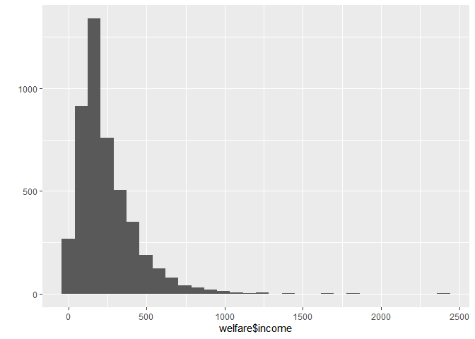
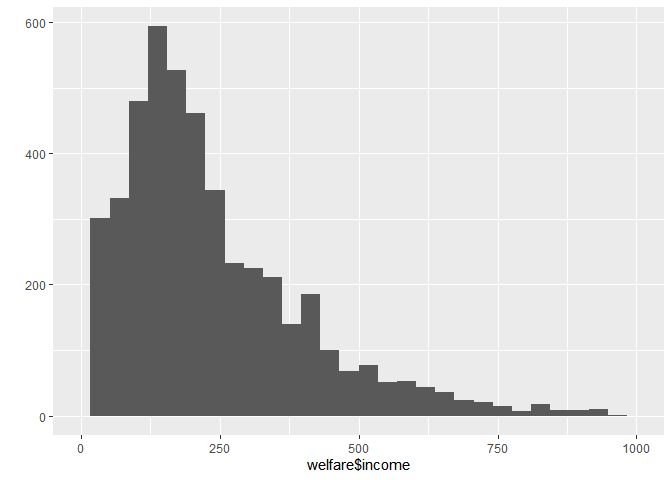
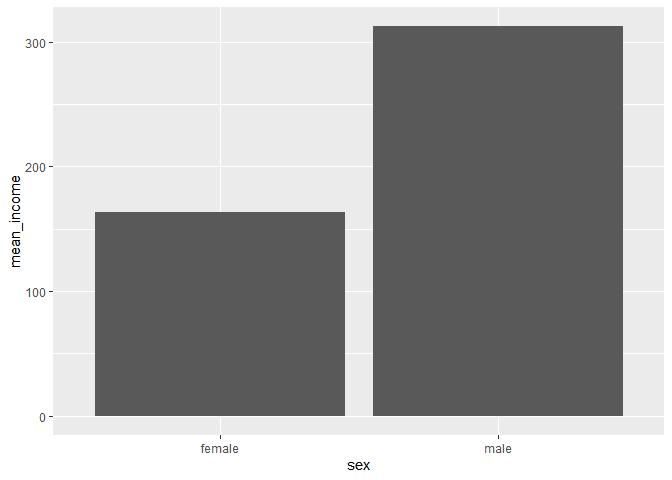

아직도 성별에 따른 월급 차이가 있을까
================
이선민
July 30, 2020

## 2\. 성별에 따른 월급 차이

과거에 비해 여성들이 활발하게 사회 진출을 한다.

하지만 직장에서 받는 대우는 여전히 차별이 존재한다.

데이터 분석을 통해 성별에 따라 월급 차이가 있는지 알아보자.

### 분석 절차

1단계. 변수 검토 및 전처리

2단계. 변수 간 관계분석

### 성별 변수 검토 및 전처리

class()로 sex(성별) 변수의 타입을 파악하고 table()로 각 범주에 몇 명이 있는지 알아보자.

#### 1\. 변수 검토하기

``` r
class(welfare$sex)
table(welfare$sex)
```

#### 2\. 전처리

``` r
table(welfare$sex)
```

    ## 
    ##    1    2 
    ## 7578 9086

``` r
welfare$sex<-ifelse(welfare$sex==9,NA,welfare$sex)
table(is.na(welfare$sex))
```

    ## 
    ## FALSE 
    ## 16664

``` r
welfare$sex<-ifelse(welfare$sex==1,"male","female")
table(welfare$sex)
```

    ## 
    ## female   male 
    ##   9086   7578

``` r
qplot(welfare$sex)
```

<!-- -->

### 월급 변수 검토 및 전처리

월급은 ’알한 달의 월 평균 임금’을 의미하며 1만원 단위로 기록되어 있다.

income(월급) 변수를 검토하고 qplot()으로 분포 확인

#### 1\. 변수 검토하기

``` r
class(welfare$income)
```

    ## [1] "numeric"

``` r
summary(welfare$income)
```

    ##    Min. 1st Qu.  Median    Mean 3rd Qu.    Max.    NA's 
    ##     0.0   122.0   192.5   241.6   316.6  2400.0   12030

``` r
qplot(welfare$income)
```

    ## `stat_bin()` using `bins = 30`. Pick better value with `binwidth`.

    ## Warning: Removed 12030 rows containing non-finite values (stat_bin).

<!-- -->

``` r
qplot(welfare$income)+xlim(0,1000)
```

    ## `stat_bin()` using `bins = 30`. Pick better value with `binwidth`.

    ## Warning: Removed 12051 rows containing non-finite values (stat_bin).

    ## Warning: Removed 2 rows containing missing values (geom_bar).

<!-- --> \#\#\#\#
2. 전처리

``` r
summary(welfare$income)
```

    ##    Min. 1st Qu.  Median    Mean 3rd Qu.    Max.    NA's 
    ##     0.0   122.0   192.5   241.6   316.6  2400.0   12030

``` r
welfare$income<-ifelse(welfare$income%in% c(0,9999),NA, welfare$income)
table(is.na(welfare$income))
```

    ## 
    ## FALSE  TRUE 
    ##  4620 12044

### 성별에 따른 월급 차이 분석하기

#### 1\. 성별 월급 평균표 만들기

``` r
sex_income<- welfare %>% 
  filter(!is.na(income)) %>% 
  group_by(sex) %>% 
  summarise(mean_income=mean(income))
```

    ## `summarise()` ungrouping output (override with `.groups` argument)

``` r
sex_income
```

    ## # A tibble: 2 x 2
    ##   sex    mean_income
    ##   <chr>        <dbl>
    ## 1 female        163.
    ## 2 male          312.

#### 2\. 그래프 만들기

``` r
ggplot(data=sex_income,aes(x=sex,y=mean_income))+geom_col()
```

<!-- -->
