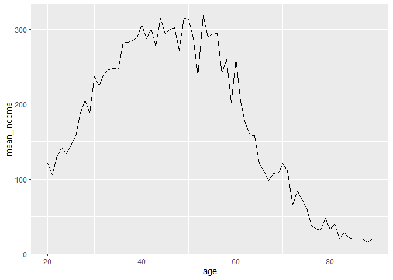

몇 살 떄 월급을 가장 많이 받을까
================
이선민
July 30, 2020

## 3\. 나이와 월급의 관계

비정규직이 많아지면서 안정된 직장에 취업하는 것도 어려워졌지만 잚은 세대를 더욱 힘들게 하는 것은 세대간 소득 격차가 심해서
사회가 불평등하게 느껴진다는 것 입니다. 나이에 따라 월급이 어떻게 다른지 데이터 분석을 통해 알아보겠습니다.

### 분석 절차

변수 검토 및 전처리(나이,월급)

변수 간 관계분석

#### 1\. 변수 검토하기

``` r
class(welfare$birth)
```

    ## [1] "numeric"

``` r
summary(welfare$birth)
```

    ##    Min. 1st Qu.  Median    Mean 3rd Qu.    Max. 
    ##    1907    1946    1966    1968    1988    2014

``` r
qplot(welfare$birth)
```

    ## `stat_bin()` using `bins = 30`. Pick better value with `binwidth`.

<!-- --> \#\#\#\#
2. 전처리

``` r
summary(welfare$birth)
table(is.na(welfare$birth))
welfare$birth <- ifelse(welfare$birth==9999,NA,welfare$birth)
table(is.na(welfare$birth))
```

#### 3\. 파생변수 만들기 - 나이

태어난 연도 변수를 이용해 나이 변수를 만든다.

2015년에 조사가 진행되었으니 2015년에서 태어난 연도를 뺀 후 1를 더해 나이를 구한다.

``` r
welfare$age<-2015 - welfare$birth + 1
summary(welfare$age)
```

    ##    Min. 1st Qu.  Median    Mean 3rd Qu.    Max. 
    ##    2.00   28.00   50.00   48.43   70.00  109.00

``` r
qplot(welfare$age)
```

    ## `stat_bin()` using `bins = 30`. Pick better value with `binwidth`.

<!-- --> \#\#\# 나이와
월급의 관계 분석하기

#### 1\. 나이에 따른 월급 평균표 만들기

``` r
age_income<- welfare %>% 
  filter(!is.na(income)) %>% 
  group_by(age) %>% 
  summarise(mean_income=mean(income))
```

    ## `summarise()` ungrouping output (override with `.groups` argument)

``` r
head(age_income)
```

    ## # A tibble: 6 x 2
    ##     age mean_income
    ##   <dbl>       <dbl>
    ## 1    20        121.
    ## 2    21        106.
    ## 3    22        130.
    ## 4    23        142.
    ## 5    24        134.
    ## 6    25        145.

#### 2\. 그래프 만들기

X축을 나이, Y축을 월급으로 지정하고 나이에 따른 월급의 변화가 표현되도록 선그래프 작성.

``` r
ggplot(data=age_income, aes(x=age, y=mean_income))+geom_line()
```

<!-- -->

출력된 그래프를 보면 20대 초반에 100만 원가량의 월급을 받고 이후 지속적으로 증가하는 추세를 보인다.

50대 무렵 300만원 초반대로 가장 많은 월급을 받고 그 이후, 지속적으로 감소하다가

70대 이후에는 20대보다 낮은 월급을 받는다.
