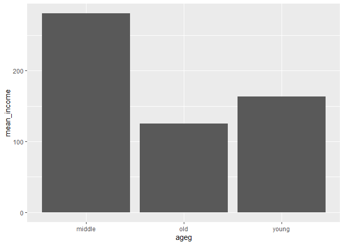

어떤 연령대의 월급이 가장 많을까
================
이선민
July 31, 2020

## 4\. 연령대에 따른 월급 차이

### 분석 절차

연령대와 월급 변수의 검토 및 전처리

변수 간 관계분석

### 연령대 변수 검토 및 전처리하기

앞서 만든 나이 변수를 이용해 연령대 변수를 만들자.

#### 1\. 파생변수 만들기 - 연령대

``` r
welfare<- welfare %>% 
  mutate(ageg= ifelse(age<30, "young",
                      ifelse(age<=59,"middle","old")))

table(welfare$ageg)

qplot(welfare$ageg)
```

<!-- -->

### 연령대에 따른 월급 차이 분석하기

변수 간 관계 분석.

#### 1\. 연령대별 월급 평균표 만들기

연령대별로 평균 월급이 다른지 알아보기 위해 연령대별 평균 월급표를 만든다.

``` r
ageg_income<- welfare %>% 
  filter(!is.na(income)) %>% 
  group_by(ageg) %>% 
  summarise(mean_income=mean(income))
```

    ## `summarise()` ungrouping output (override with `.groups` argument)

``` r
ageg_income
```

#### 2\. 그래프 만들기

``` r
ggplot(data=ageg_income,aes(x=ageg, y=mean_income)) + geom_col()
```

<!-- -->

#### 막대 정렬 : 초년, 중년, 노년 나이 순

``` r
ggplot(data=ageg_income, aes(x=ageg, y=mean_income))+
  geom_col()+
  scale_x_discrete(limits=c("young","middle","old"))
```

<!-- -->

표와 그래프를 보면 중년이 280만 원 정도로 가장 많은 월급을 받는다는 것을 알 수 있다.

노년은 125만 원 정도로 초년이 받는 163만 원보다 적은 월급을 받는다.
