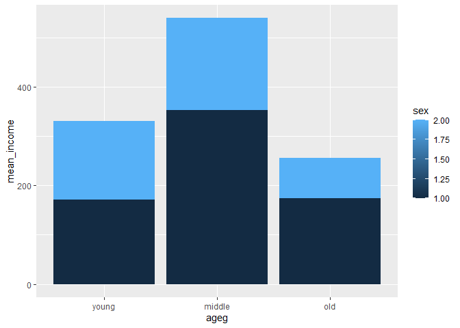
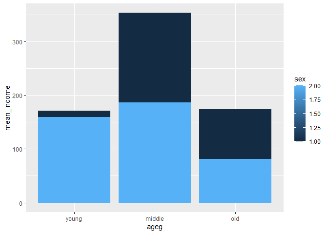
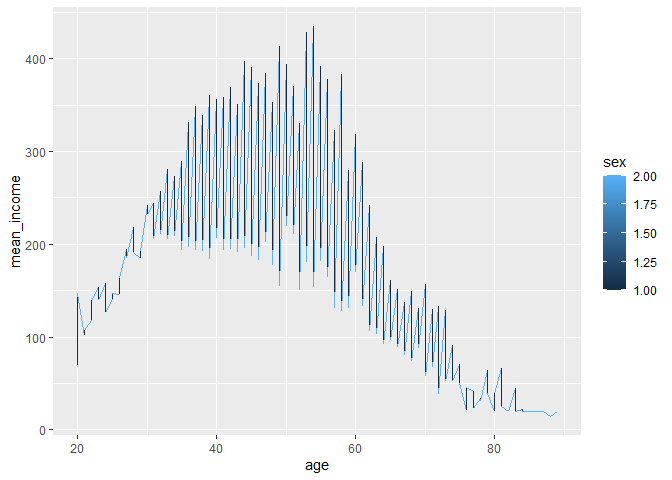

성별 월급 차이는 연령대별로 다를까
================
이선민
July 31, 2020

## 5\. 연령대 및 성별 월급 차이

### 분석 절차

연령대, 성별, 월급에 따른 변수 검토 및 전처리

변수 간 관계 분석

### 연령대 및 성별 월급 차이 분석하기

#### 1\. 연령대 및 성별 월급 평균표 만들기

각 연령대에서 성별에 따른 월급에 차이가 있는지 알아보기 위해 연령대 및 성별에 따른 월급 평균표 만들기.

``` r
sex_income<- welfare %>% 
  filter(!is.na(income)) %>% 
  group_by(ageg, sex) %>% 
  summarise(mean_income=mean(income))
```

    ## `summarise()` regrouping output by 'ageg' (override with `.groups` argument)

``` r
sex_income
```

#### 2\. 그래프 만들기

``` r
ggplot(data=sex_income, aes(x=ageg, y=mean_income, fill=sex))+
  geom_col()+
  scale_x_discrete(limits= c("young","middle","old"))
```

<!-- -->

표와 출력된 그래프를 보면 성별 월급 차이의 양상이 연령대별로 다르다는 것을 알 수 있다.

초년에는 차이가 크지 않지만 중년에 크게 벌어져 남성이 166만 원가량 더 많다.

노년에는 차이가 줄어들지만 여전히 남성의 월급이 92만 원가량 더 많다.

하지만 성별로 나눈 분석결과, 남성의 경우 노년과 초년 간 월급 차이가 크지 않다.

노년이 초년보다 적은 월급을 받는 현상은 여성에만 나타난다.

#### 성별 막대 분리

각 성별의 월급이 연령대 차이를 비교하기 쉽게 하기 위해 geom\_col()의 position 파라미터를 “dodge”로
설정하여 막대를 분리한다.

``` r
ggplot(data=sex_income,aes(x=ageg, y=mean_income,fill=sex))+
  geom_col(position="dodge") +
  scale_x_discrete(limits=c("young","middle","old"))
```

<!-- -->

### 나이 및 성별 월급 차이 분석하기

#### 그래프 만들기

``` r
sex_age<- welfare %>% 
  filter(!is.na(income)) %>% 
  group_by(age,sex) %>% 
  summarise(mean_income= mean(income))
```

    ## `summarise()` regrouping output by 'age' (override with `.groups` argument)

``` r
head(sex_age)

ggplot(data=sex_age, aes(x=age, y=mean_income, col=sex))+geom_line()
```

<!-- -->

출력된 그래프를 보면 남성의 월급은 50세 전후까지 지속적으로 증가하다가 감소한다.

반면 여성은 30새 전후까지 약간 상승하다가 그 이후로는 지속적으로 완만하게 감소하는 것을 알 수 있다.

성별 월급격차는 30세부터 지속적으로 벌어져 50대 초반에 가장 크게 벌어지고

그 이후 점차 줄어들어 70대 후반이 되면 비슷한 수준이 된다는 것을 알 수 있다.
